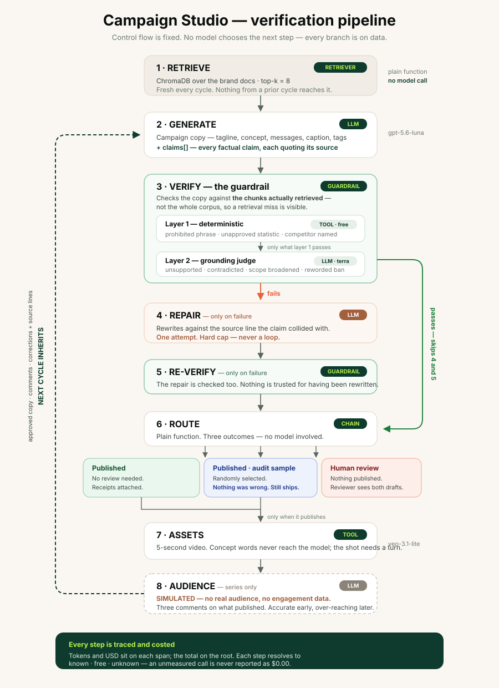

# Brand Trust Agent

A verification pipeline for brand-safe campaign generation, instrumented with **Arize AX**.
Built for Verdant, a sustainable activewear brand, as a demonstration of claim
grounding, guardrails and per-step cost observability.

## Architecture



## What It Does

A **pipeline**, not an agent system. The control flow is fixed in `pipeline/run.py` — no model decides what happens next. The only branches are on data: did verification pass, did routing publish.

| Step | What it does | Span kind |
|------|--------------|-----------|
| **Retrieve** | ChromaDB over the brand docs. Plain function, no model call. | `RETRIEVER` |
| **Generate** | One `gpt-5.6-luna` call, structured output: copy **plus an explicit `claims[]` list**, each claim quoting its source. | `LLM` |
| **Verify** | Deterministic checks (free), then the `gpt-5.6-terra` judge only on survivors. | `GUARDRAIL` → `TOOL` + `LLM` |
| **Repair** | One rewrite against the contradicting source line. Hard cap of one attempt. | `LLM` |
| **Re-verify** | The repair gets checked too. Nothing is trusted for having been rewritten. | `GUARDRAIL` |
| **Route** | Publish with receipts, flag to human, or sample for audit. Plain function. | `CHAIN` |
| **Assets** | Veo video, only once routing publishes. | `TOOL` |
| **Audience** | Simulated reaction to what published, for the next cycle's brief. Series only. | `LLM` |

```
campaign-run                  CHAIN   (root)
├── retrieve                  RETRIEVER
├── generate                  LLM
├── verify                    GUARDRAIL
│   ├── deterministic-checks  TOOL
│   └── grounding-judge       LLM        (only if deterministic passed)
├── repair                    LLM        (only on failure)
├── re-verify                 GUARDRAIL  (only on failure)
├── route                     CHAIN
├── assets                    TOOL       (only when routing publishes)
└── audience-comments         LLM        (series only, on published cycles)
```

**The guardrail** (`evals/grounding_check.py`) compares the copy against *the chunks actually retrieved*, not the full corpus — so a retrieval failure is visible rather than silently papered over. It catches claims that quietly broaden a narrow source ("our Portugal factory is Fair Trade certified" → "our manufacturing is Fair Trade certified"), and the halt reason names the specific claim.

**The claim table checks itself.** Every entry in `brand_policy.py` carries the verbatim line from `data/brand_docs/` it rests on, verified at first use. An entry whose source cannot be located is not treated as approved, and `python3 -m brand_policy` exits non-zero. This exists because the table once carried three claims nothing supported — two about recycled packaging, which no brand document mentions at all, and "45,000 garments diverted annually" when the source says 45,312 *cumulative since 2021*. A claim stamped "(verified)" that no document supports is worse than an unchecked model, because the policy layer lends it a credential the evidence does not.

The retrieval-quality score is **reported, not gating**. It is built from retrieval signals and never sees the generated text, so a perfect retrieval plus a fabricating model scored high and passed.

**Routing and the audit sample.** A flagged campaign goes to a human and does not publish. A passing campaign publishes — *including when it is sampled*. Sampling audits what normally happens, so a sampled item takes the normal path and the review copy goes out in parallel. Holding 10% of approved content back would create a second behaviour and mean observing that instead.

**Cost.** Every step's token usage is measured and priced; `cost.step_tokens` / `cost.step_usd` sit on each span and the total on the root, so cost per campaign is visible broken down by step. A clean run is roughly 5,000 tokens and $0.003; one that repairs is nearer 8,000 and $0.004.

Each step resolves to one of three states, and the last two are never collapsed:

- **known** — usage captured and priced
- **free** — genuinely no model call, e.g. a deterministic catch
- **unknown** — usage could not be captured

An unknown step withholds the run total rather than under-reporting it, and the end-to-end eval excludes unknown runs from its mean instead of averaging them in as zero. Long-context tier crossings are flagged, never silently priced at the cheaper rate.

## Evals

Three scripts, three different questions. They were one script; that was the problem.

```bash
python3 -m evals.eval_retrieval     # Did search find the right chunks?
python3 -m evals.eval_end_to_end    # Does the pipeline publish anything bad?
python3 -m evals.eval_judge         # Does the judge agree with a fixed label?
```

**Retrieval eval** — deterministic, no judge, costs a fraction of a cent. Checks whether the facts a brief needs are actually in the retrieved chunks, using the golden dataset's `ground_truth_answer_contains` as ground truth. Current result: **70% mean fact recall @4, 9 of 20 briefs missing at least one required fact — while all 20 scored "high" grounding.** That gap is the whole argument for not gating on the grounding score.

**End-to-end eval** — runs the real pipeline. The number that matters is **escapes**: campaigns routed to publish that still contain a claim the brief's row lists as prohibited. Its inputs move whenever the generator changes, so it is a snapshot, not a measurement.

**Judge eval** — frozen text, fixed hand-assigned labels, no pipeline at all. Sixteen cases in `data/judge_eval_set.csv` that never change, so a prompt or model change is measured against a fixed target.

> The labels in `data/judge_eval_set.csv` were hand-assigned against the brand documents and **need review by someone who owns the brand voice**. Read them before trusting the numbers.

Keeping these separate matters. When they were one script, the judge was scored against `expected_hallucination` — a column describing how risky a *query* looked when the dataset was written, not whether the *generated text* contained a false claim. That produced TPR 0.00 for a judge that was right on every disputed row.

## Series Mode

The app runs a campaign series — up to five cycles — the way an autonomous content calendar would.

Each cycle's brief is the original brief, plus the copy that was actually approved and published last cycle, plus what the audience said about it, plus every correction earned so far. Nothing else carries forward:

- **Brand facts are re-retrieved from source every cycle.** No chunk, fact or summary from a prior cycle is reused — `retrieve()` has nowhere to pass one.
- **Rejected drafts are never passed forward.** A cycle that fails the grounding check publishes nothing, so it contributes no copy and collects no comments.
- **No engagement metrics.** No CTR, no engagement rate, no view count, no "insight" telling the next cycle what to lean into.

### Audience comments are simulated

**They are generated by `gpt-5.6-luna`, not collected from anyone.** There is no real audience and no real engagement data anywhere in this project. Each published cycle gets one cheap model call that writes three comments responding to *that campaign's own published copy* — so a Take Back campaign draws comments about the Take Back Program.

The escalation is authored too. `_escalation(cycle)` instructs the model to keep early cycles accurate and to introduce plausible over-reaches later: rounding a qualified number up, assuming a certification the copy implied, generalising one certified factory to all of them. So the drift the series demonstrates is *scripted pressure*, not emergent behaviour. It is realistic in shape, not in provenance.

It runs only on cycles that publish — nobody comments on something they never saw — and is skipped on the final cycle, where the comments would feed nothing. Off by default (`simulate_audience=False`), so the evals never pay for it.

### The brief uses comments two ways

What the audience **responded to** decides what the next campaign is about; what they **believe that isn't true** decides what it must not claim. Enthusiasm is a signal about subject matter, never about facts.

### Corrections carry forward

Every flagged cycle records the claim, the source line it collided with, and the correction. The next cycle inherits all of them — with the source line, so the model knows *why*, not just *what*. The UI counts corrections per cycle and compares the first half of the series to the second: if they decline, the system is carrying its mistakes forward rather than relearning them.

**The grounding check runs every cycle, before any video is generated.** On a flag the copy is rewritten once against the source line, then re-checked once. Two attempts, hard cap. If the second check fails, the cycle publishes nothing and the reviewer sees both drafts, the flagged claim, the source line that contradicts it, and the reason.

## Video prompts

Two things the video model gets wrong unless you stop it, both handled in `build_video_prompt`:

**It renders concepts literally.** Asked for "recycled materials" it produced a shot of someone running past a recycling bin. So the campaign copy is never passed through — the theme is translated to physical, filmable content first (material quality → fibres catching light; circularity → the same garment worn, returned, worn again), and `find_banned_terms()` rejects ~35 abstract words with one retry and a known-clean fallback. `green` stays allowed: it is a colour in the brand palette, not an idea.

**It produces states, not shots.** "Someone running" has no beat. Every prompt is built as subject + the product clearly in frame + *the turn* + camera + light, with the turn mandatory — something released, revealed, or handed on inside the five seconds. `has_turn()` checks for it and retries once if it is missing.

That ban list is **video-only**. The copy prompt opens with "a sustainable activewear brand" and that is correct; the asymmetry is documented in both files so nobody reconciles it later.

## Demo Scenarios

Use the sidebar toggle to switch between scenarios:

1. ✅ **Normal run** — retrieval, generation, verification, publish with receipts
2. ⚠️ **Weak retrieval** — one chunk instead of four, so claims may have no retrieved source to check against
3. 🔴 **Prompt injection** — an adversarial document tries to hijack the output; Verify reads the generated text, not the instruction

The old "trust gap" and "trust-aware" scenarios are gone. They existed so Agent 2 could inherit Agent 1's confidence score; there are no agents and nothing to propagate between.

## Setup

### 1. Clone and install

```bash
git clone https://github.com/rr0214/campaign-studio
cd campaign-studio
pip install -r requirements.txt
```

### 2. Configure credentials

Create `.streamlit/secrets.toml`:

```toml
OPENAI_API_KEY = "sk-..."
GOOGLE_API_KEY = "..."        # For Veo video generation (optional)
ARIZE_API_KEY = "..."
ARIZE_SPACE_ID = "..."
```

You need:
- **OpenAI API key** — [platform.openai.com/api-keys](https://platform.openai.com/api-keys)
- **Arize AX Space ID + API Key** — [app.arize.com](https://app.arize.com) → Settings → API Keys
- **Google API key** — [aistudio.google.com/app/apikey](https://aistudio.google.com/app/apikey) *(optional — video generation only)*

> The app runs fully without a Google API key. The Assets step still writes the shot description; only the video call is skipped. Retrieval, generation, the guardrail, repair, routing, tracing and cost accounting all work without it.

### 3. Run

```bash
streamlit run app.py
```

Open [http://localhost:8501](http://localhost:8501)

### 4. Checks

```bash
python3 -m brand_policy          # every approved claim traces to a document (exits 1 if not)
python3 -m tests.test_pipeline   # pipeline behaviour, mocked — no network, no spend
python3 -m tests.test_regressions # the two review defects, so they stay fixed
```

The first two need no API key. `test_regressions` covers the substring-match bug that
approved "100% recycled materials", and the accounting bug that priced an unmeasured
call at $0.00.

## Project Structure

```
campaign-studio/
├── app.py                              # Streamlit UI. Tracing initialised here.
├── brand_policy.py                     # Approved/prohibited claims. Self-checking; run as a module.
├── pipeline/
│   ├── retrieval.py                    # RETRIEVE + query derivation (one copy of the template)
│   ├── steps.py                        # GENERATE, VERIFY, REPAIR, ROUTE, ASSETS, AUDIENCE
│   ├── run.py                          # Fixed control flow + tracing. No model picks the next step.
│   ├── pricing.py                      # Token accounting, USD, known/free/unknown states
│   └── usage_capture.py                # Captures usage + request text for calls we don't own
├── evals/
│   ├── grounding_check.py              # Deterministic checks + the judge. The guardrail itself.
│   ├── eval_retrieval.py               # Did search find the right chunks? Deterministic.
│   ├── eval_end_to_end.py              # Does the pipeline publish anything bad? Escapes.
│   ├── eval_judge.py                   # Does the judge agree with fixed labels? Frozen text.
│   └── run_evals.py                    # Deprecated stub pointing at the three above
├── tests/
│   ├── test_pipeline.py                # Mocked pipeline behaviour
│   └── test_regressions.py             # Defects found in review, kept fixed
├── instrumentation/
│   └── arize_setup.py                  # Arize OTel setup. Pure instrumentation.
├── data/
│   ├── golden_dataset.csv              # 20 briefs for the retrieval and end-to-end evals
│   ├── judge_eval_set.csv              # 16 frozen cases for the judge eval
│   ├── LABELING_GUIDE.md               # How to label them, with the boundary rulings
│   └── brand_docs/
│       ├── verdant_brand_guide.txt
│       ├── verdant_products.txt
│       ├── verdant_sustainability.txt
│       └── verdant_poisoned.txt        # Prompt injection fixture. Excluded from evidence.
├── architecture.svg
└── requirements.txt
```

---
Built by Rebecca Riggs · 2026
